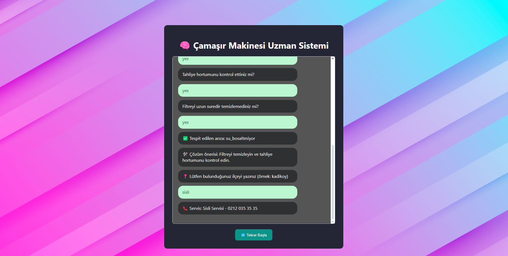

# Çamaşır Makinesi Arıza Tespit Sistemi

Bu proje, çamaşır makinelerinde oluşan arızaları hızlı ve etkili bir şekilde teşhis edebilen, **soru-cevap tabanlı bir uzman sistemdir.** Kullanıcı arayüzü üzerinden kullanıcıya basit sorular yöneltilir ve bu cevaplara göre sistem, **muhtemel arızayı** belirler. Eğer hata tespiti yapılırsa, son olarak kullanıcıdan İstanbul'daki bulunduğu **ilçe** bilgisi istenir ve ilgili **yetkili servis iletişim numarası** kullanıcıya sunulur.

---

## 🔍 Projenin Amacı

Amaç; kullanıcıların teknik bilgiye ihtiyaç duymadan çamaşır makinesi arızalarını belirleyebilmelerini ve en yakın teknik servise ulaşabilmelerini sağlamaktır. Sistem hem bireysel kullanıcılar hem de müşteri hizmetleri temsilcileri tarafından kullanılabilecek şekilde tasarlanmıştır.

---

## 🛠️ Kullanılan Teknolojiler

| Katman | Teknoloji |
|--------|-----------|
| Backend Mantığı | **Prolog** (Uzman sistem karar yapısı) |
| API ve Bağlantı | **Python (Flask)** |
| Frontend (Arayüz) | **JavaScript (React)** - `App.js` ve `CSS` |
| Görselleştirme | Görsel destekli basit kullanıcı arayüzü |

---

## 🧠 Projenin Çalışma Yapısı

1. Kullanıcı arayüzünde kullanıcıya, arıza hakkında birkaç soru sorulur.
2. Bu sorulara verilen yanıtlar, **Prolog uzman sistemine** gönderilir.
3. Prolog, bu cevaplara göre **en olası arızayı tahmin eder.**
4. Eğer arıza tespiti başarılıysa, sistem kullanıcıdan **İstanbul ilçesini** ister.
5. İlçeye göre **yetkili servis numarası** gösterilir.

---

## 📸 Uygulama Görünümü

Aşağıda, sistemin arayüzünü gösteren bir ekran görüntüsü yer almaktadır:



---

## 🚀 Nasıl Çalıştırılır?

### 1. Gereksinimler
- Python 3.8+
- SWI-Prolog
- Node.js ve npm

### 2. Terminal Komutları

#### 🔹 Backend (Flask + Prolog)
```bash
cd backend
python app.py
#### 🔹 Frontend
cd frontend
npm install
npm start
